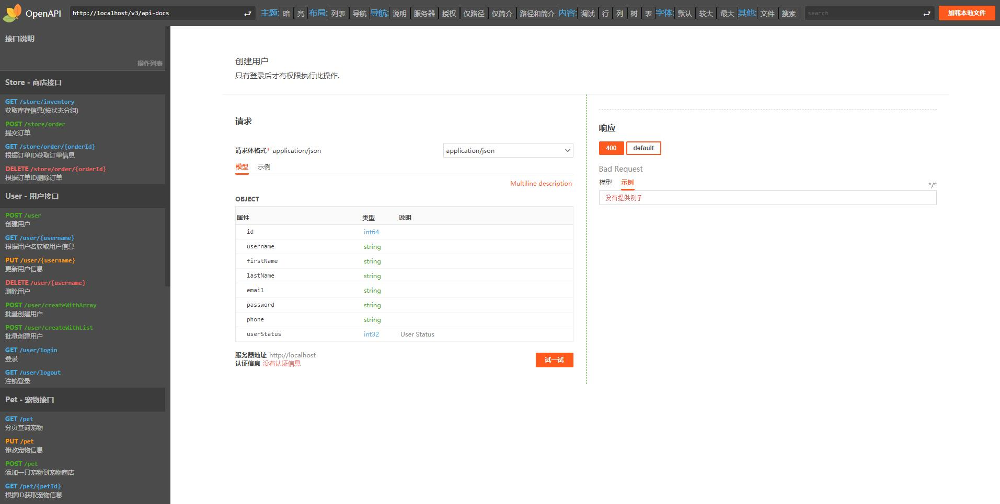

# Wapache OpenAPI Project

`Wapache OpenAPI Project`是一个整合了openapi spec, swagger-api, springdoc, rapidoc, openapi-generator等多个开源项目, 
用于OpenAPI学习, 提供Spring整合, 代码生成和文档生成, 可视化展示等功能整合的项目。
本项目在众多开源项目基础上针对中文环境和使用习惯做了一定裁剪,扩展和汉化。

主要引入了以下项目:

1. [OAI/OpenAPI-Specification](https://github.com/OAI/OpenAPI-Specification)
2. [swagger-api/swagger-core](https://github.com/https://github.com/swagger-api/swagger-core)
3. [swagger-api/swagger-parser](https://github.com/swagger-api/swagger-parser)
4. [swagger-api/swagger-js](https://github.com/swagger-api/swagger-js)
5. [springdoc/springdoc-openapi](https://github.com/springdoc/springdoc-openapi)
6. [springdoc-openapi-demos](https://github.com/springdoc/springdoc-openapi-demos)
7. [OpenAPITools/openapi-generator](https://github.com/OpenAPITools/openapi-generator)
8. [mrin9/RapiDoc](https://github.com/mrin9/RapiDoc)

主要做了以下修改:

1. 统一了包名前缀, 统一为`org.wapache.openapi`。
2. 删除`swagger-core`中的JAXRS支持, 删除`openapi-generator`中不常用到的语言支持。
3. 添加了`wapa` JS客户端代码生成模板, 修改了`openapi-generator`的代码, 增加了生成`AllApi.js`的功能。
4. 删除`springdoc-openapi`中除Java语言外的其他语言支持, 删除`webflux`支持, `spring-boot`降级为`2.0.4`版本。
5. 原`springdoc`的`RequestBody`重命名为`ApiRequestBody`,以避免与Spring的`RequestBody`名称重复导致使用不便。
6. 部分汉化`Rapidoc`, 对`Rapidoc`界面布局和样式做了调整和增强。

## 模块列表

| 模块                       | 来源(github)                                                  | 说明 |
| -------------------------- | ------------------------------------------------------------ | ---- |
| openapi-annotations        | swagger-api/swagger-core/modules/swagger-annotations         |      |
| openapi-core               | swagger-api/swagger-core/modules/swagger-core                |      |
| openapi-generator          | openapi-generator/modules/openapi-generator                  |      |
| openapi-generator-cli      | openapi-generator/modules/openapi-generator-cli              |      |
| openapi-generator-core     | openapi-generator/modules/openapi-generator-core             |      |
| openapi-integration        | swagger-api/swagger-core/modules/swagger-integration         |      |
| openapi-models             | swagger-api/swagger-core/modules/swagger-models              |      |
| openapi-parser             | swagger-api/swagger-parser                                   |      |
| openapi-specification      | OAI/OpenAPI-Specification                                    |      |
| openapi-spring-common      | springdoc-openapi/springdoc-openapi-common                   |      |
| openapi-spring-webjars-ui  | springdoc-openapi/springdoc-openapi-ui                       |      |
| openapi-spring-webmvc-core | springdoc-openapi/springdoc-openapi-webmvc-core              |      |
| openapi-spring-webmvc-demo | springdoc-openapi-demos/springdoc-openapi-spring-boot-2-webmvc |      |
| openapi-test               | -                                                            |      |
| openapi-ui                 | mrin9/RapiDoc                                                |      |

## 编译运行

```shell script
cd openapi-ui/rapidoc
npm install
npm run build # windows下运行: npm run build_windows

cd ../..
mvn clean package
cd openapi-spring-webmvc-demo/target
java -jar openapi-spring-webmvc-demo-0.10.8-SNAPSHOT.jar
```

## 界面预览

暗黑主题:


明亮主题:



#其他资源

1. 中文版规范: https://github.com/fishead/OpenAPI-Specification/blob/master/versions/3.0.0.zhCN.md

2. 中文教程: https://www.breakyizhan.com/swagger/2806.html


3. [API Documentation with springdoc-openapi](https://mflash.dev/blog/2020/06/27/api-documentation-with-springdoc-openapi/)

    OpenAPI Initiative is a widely adopted industry standard to describe and document APIs, with Swagger being one of its most well-known implementations. For years, Springfox, using Swagger, has provided a well-adopted toolchain for Spring projects to generate OpenAPI documentation and provide a UI on the top of it. Unfortunately, the Springfox project is not frequently maintained; its latest release v2.9.2 at the timing of writing this post was in 2018. This is where springdoc-openapi comes into picture.

    Springdoc is a relatively young open-source project that adds several new features not available in Springfox at the moment, including the support for OpenAPI Specification 3 (OAS 3) and functional and reactive Spring APIs to create REST endpoints. In this post, we'll explore how we can use Springdoc with a Spring Boot project.

4. [openapi整合spring-security表单登录](https://waynestalk.com/spring-security-form-login-jpa-springdoc-explained/)


# 请作者喝杯奶茶

