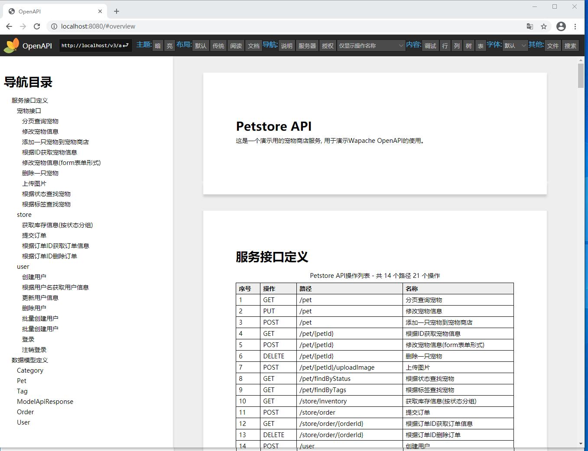
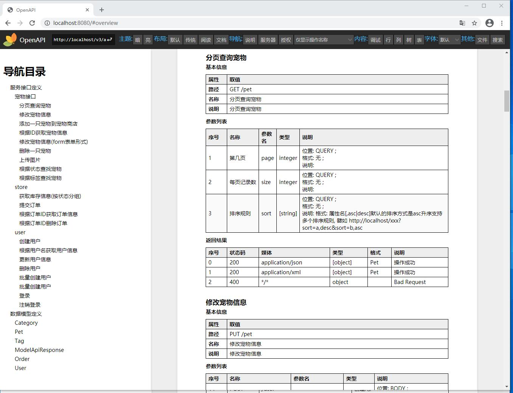
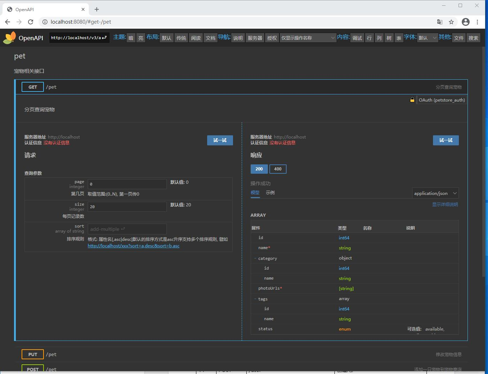
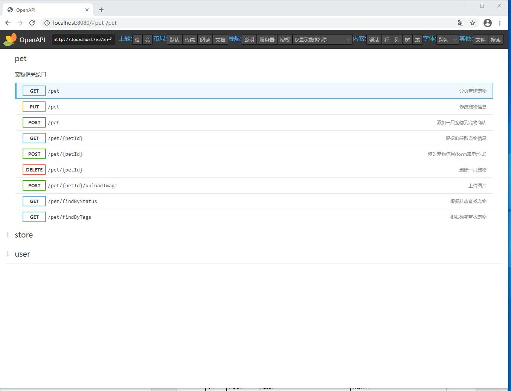
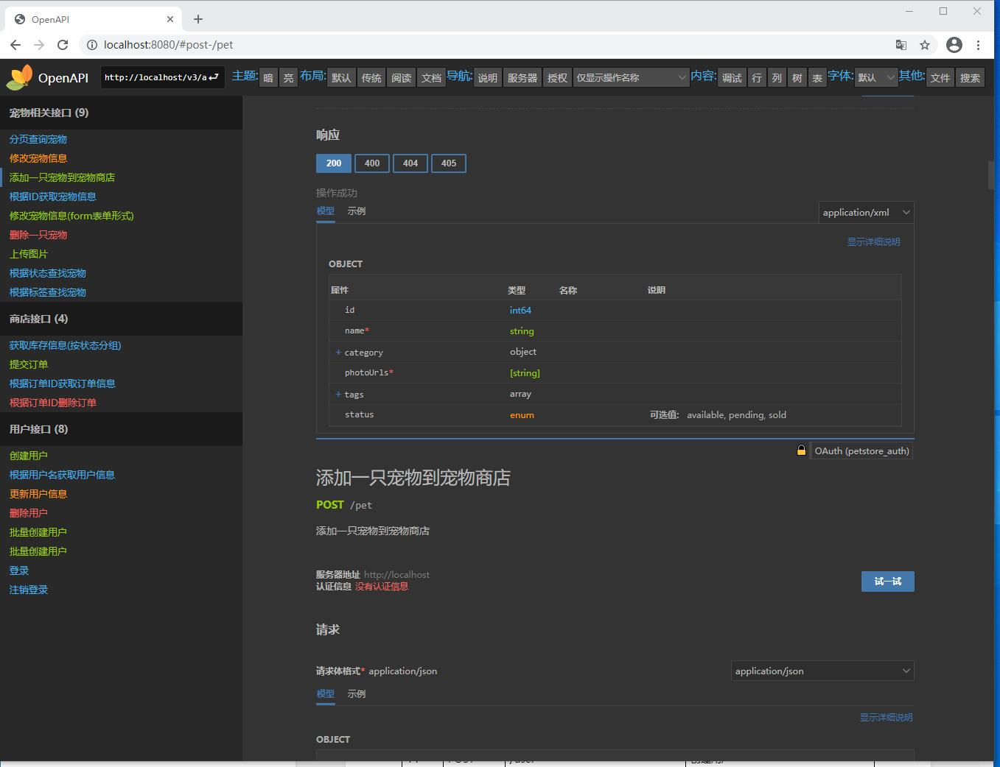

# wapadoc - The Wapache OpenAPI Project

`wapadoc`是一个基于 [OpenAPI V3](https://github.com/OAI/OpenAPI-Specification) 规范开发的类库，旨在通过OpenAPI规范化接口设计、编码和文档的编写，提高第三方对接的开发和调试体验。

本项目期望能帮助您摆脱传统开发模式的`文档版本管理混乱`，`文档和代码不一致`，`接口设计不规范`，`第三方缺少可运行示例对接效率低下`，`开发人员不写注释`等等众多问题的困扰。
OpenAPI支持`设计优先+代码生成`和`代码优先+文档生成`两种开发模式，对于设计者本身就是Java开发人员的情况，强烈建议`代码优先`模式进行开发，能很好的贯彻`代码即文档`的开发理念，同时还可以获得文档版本化管理和IDE支持等等一系列好处。

## 模块列表

`wapadoc`项目的命名主要参考自`springdoc`和`rapidoc`，本项目的主要代码也是来自于这两个项目，一个是后台服务，一个前端界面，这俩项目非常优秀，推荐学习使用。

| 模块                       | 来源(github)                                                  | 说明 |
| -------------------------- | ------------------------------------------------------------ | ---- |
| openapi-annotations        | swagger-api/swagger-core/modules/swagger-annotations         |      |
| openapi-core               | swagger-api/swagger-core/modules/swagger-core                |      |
| openapi-generator          | openapi-generator/modules/openapi-generator                  |      |
| openapi-generator-cli      | openapi-generator/modules/openapi-generator-cli              |      |
| openapi-generator-core     | openapi-generator/modules/openapi-generator-core             |      |
| openapi-integration        | swagger-api/swagger-core/modules/swagger-integration         |      |
| openapi-models             | swagger-api/swagger-core/modules/swagger-models              |      |
| openapi-parser             | swagger-api/swagger-parser                                   |      |
| openapi-specification      | OAI/OpenAPI-Specification                                    |      |
| openapi-spring-common      | springdoc-openapi/springdoc-openapi-common                   |      |
| openapi-spring-webjars-ui  | springdoc-openapi/springdoc-openapi-ui                       |      |
| openapi-spring-webmvc-core | springdoc-openapi/springdoc-openapi-webmvc-core              |      |
| openapi-spring-webmvc-demo | springdoc-openapi-demos/springdoc-openapi-spring-boot-2-webmvc |      |
| openapi-test               | -                                                            |      |
| openapi-ui                 | mrin9/RapiDoc                                                |      |

## 编译运行

```shell script

cd openapi-ui/rapidoc
npm install
npm run build # windows下运行: npm run build_windows

cd ../..
mvn clean package
cd openapi-spring-webmvc-demo/target
java -jar openapi-spring-webmvc-demo-0.10.28-SNAPSHOT.jar

# 浏览器打开`http://localhost` 或者 `http://localhost/openapi-ui.html`

```

## 界面预览

### 文档模式

文档模式是目前市面上各种OpenAPI-UI都没有的显示模式, 是此项目的特色功能。
此功能以大家都很熟悉的Word文档样式展示接口内容，且可以直接全选复制到Word或者WPS上得到标准的接口文档。
有了这个功能, 从此就不用怕第三方找你要接口文档啦!





### 传统模式

此模式与传统的SwaggerUI展示方式类似, 相信用过springfox和springdoc的同学都很熟悉了。
本模式下, 还额外提供了请求和响应并排显示功能, 在高分辨率下可以一屏展示更多内容, 获得更好的用户体验。





### 默认模式

此模式是本项目的默认展示模式, 在 `Rapidoc` 中称为`专注`布局, 只展示当前选中的接口。


### 阅读模式

与默认模式雷同, 只是有滚动条, 可以滚动到其他接口, 在阅读和浏览接口的时候比较方便。



## 在线代码生成服务

服务启动

```

cd openapi-generator-server/target
java -jar openapi-generator-server-0.10.28-SNAPSHOT.jar

# 浏览器打开`http://localhost` 或者 `http://localhost/openapi-ui.html`

```

# 引用项目

`wapadoc`是一个整合了openapi spec, swagger-api, springdoc, rapidoc, openapi-generator等多个开源项目, 提供Spring集成, 代码生成和文档生成, 可视化展示等功能整合的项目。 
本项目在众多开源项目基础上针对中文环境和使用习惯做了一定裁剪,扩展和汉化。

主要引入了以下项目:

1. [OAI/OpenAPI-Specification](https://github.com/OAI/OpenAPI-Specification)
2. [swagger-api/swagger-core](https://github.com/https://github.com/swagger-api/swagger-core)
3. [swagger-api/swagger-parser](https://github.com/swagger-api/swagger-parser)
4. [swagger-api/swagger-js](https://github.com/swagger-api/swagger-js)
5. [springdoc/springdoc-openapi](https://github.com/springdoc/springdoc-openapi)
6. [springdoc-openapi-demos](https://github.com/springdoc/springdoc-openapi-demos)
7. [OpenAPITools/openapi-generator](https://github.com/OpenAPITools/openapi-generator)
8. [mrin9/RapiDoc](https://github.com/mrin9/RapiDoc)

主要做了以下修改:

1. 统一了包名前缀, 统一为`org.wapache.openapi`。
2. 删除`swagger-core`中的JAXRS支持, 删除`openapi-generator`中不常用到的语言支持。
3. 添加了`wapa` JS客户端代码生成模板, 修改了`openapi-generator`的代码, 增加了生成`AllApi.js`的功能。
4. 删除`springdoc-openapi`中除Java语言外的其他语言支持, 删除`webflux`支持, `spring-boot`降级为`2.0.4`版本。
5. 原`springdoc`的`RequestBody`重命名为`ApiRequestBody`,以避免与Spring的`RequestBody`名称重复导致使用不便。
6. 部分汉化`Rapidoc`, 对`Rapidoc`界面布局和样式做了调整和增强。
7. `Rapidoc`界面布局增加`文档`模式, 以word文档样式的方式展示OpenAPI文档的内容, 全选复制到word即可得到word格式的接口文档, 非常方便。 
8. 引入`openapi-generator`中的`openapi-generator-online`, 去掉springfox的依赖并对接口做少量调整和汉化。


#其他资源

1. 中文版规范: https://github.com/fishead/OpenAPI-Specification/blob/master/versions/3.0.0.zhCN.md

2. 中文教程: https://www.breakyizhan.com/swagger/2806.html

3. [API Documentation with springdoc-openapi](https://mflash.dev/blog/2020/06/27/api-documentation-with-springdoc-openapi/)

    OpenAPI Initiative is a widely adopted industry standard to describe and document APIs, with Swagger being one of its most well-known implementations. For years, Springfox, using Swagger, has provided a well-adopted toolchain for Spring projects to generate OpenAPI documentation and provide a UI on the top of it. Unfortunately, the Springfox project is not frequently maintained; its latest release v2.9.2 at the timing of writing this post was in 2018. This is where springdoc-openapi comes into picture.

    Springdoc is a relatively young open-source project that adds several new features not available in Springfox at the moment, including the support for OpenAPI Specification 3 (OAS 3) and functional and reactive Spring APIs to create REST endpoints. In this post, we'll explore how we can use Springdoc with a Spring Boot project.

4. [openapi整合spring-security表单登录](https://waynestalk.com/spring-security-form-login-jpa-springdoc-explained/)

# 欢迎使用

本项目开始之初原本是作者的一个学习OpenAPI的练手项目，目前通过整合网上各种优质资源后已经初步具备投入使用的条件，欢迎尝鲜使用。

有任何使用上的问题可以在github的issues上提, 也可以发邮件到作者的邮箱(ykuang老鼠wapache点org)。

# 请作者喝杯奶茶

开源不易, 如果此项目对你有用, 请作者喝杯茶以资鼓励吧\^_\^!


